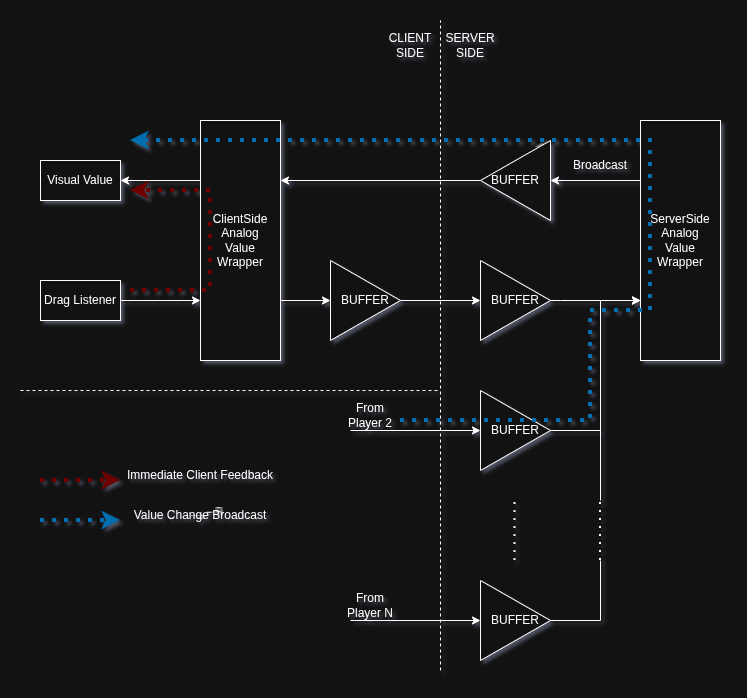

Welcome to the first ever dev log for Pinewood Builders Propulsion Research Facility! In this series, I aim to document the progress I've made on the game by showing some of the stuff I've implemented that I find to be significant enough for people to see.

After years of anticipation with very bumpy roads along the way in the development of this game, I've decided to start this series so that people know the project is not dead, rather it's being worked on over time. That being said, I think it's time to showcase the stuff I've worked on.

## 1. Custom Facility Interactions

The first thing I've ever tackled during the re-rescript of PBPRF was the interaction system. I believe one of the traits that define a video game's quality is how it feels to interact with the environment. So that's why I coded the interaction objects first.

Note that I am not using `DragDetector` here, I chose not to because it just felt clunky. Physical response didn't feel right and Geometric did not provide any limitations I could do with the interaction. So I just coded my own.

Additionally, these interactions are highlighted when you get your mouse *near* them on PC, or your character near them on Mobile. I built this system to be responsive so it adapts to the player's `PreferredInput`.

<iframe width="560" height="315" src="https://www.youtube.com/embed/EzNPDi7-TxI" title="YouTube video player" frameborder="0" allow="accelerometer; autoplay; clipboard-write; encrypted-media; gyroscope; picture-in-picture; web-share" referrerpolicy="strict-origin-when-cross-origin" allowfullscreen></iframe>

## 2. Analog Replication Backend

**TL;DR: Here is a demonstrative video of how the system works:**

<iframe width="560" height="315" src="https://www.youtube.com/embed/li04xC7BwAU" title="YouTube video player" frameborder="0" allow="accelerometer; autoplay; clipboard-write; encrypted-media; gyroscope; picture-in-picture; web-share" referrerpolicy="strict-origin-when-cross-origin" allowfullscreen></iframe>

This is one of my favorite features I've implemented in Roblox ever. It is essentially built for the levers and valves I mentioned above. The problem is that these are *analogous* interactions, unlike buttons, which are *digital*.

But before we tackle handling this chaotic data, we need to define the problem space first. Basically, I aim to achieve three goals:
* Client side immediate visual feedback
* Server-sided source of truth
* Reduced network strain

Firstly, we need to make note of how these interactions are being made. Let's go with the example of analog levers. Because of the continuous nature of levers, they tend to make a lot of changes over a small passage of time. Meaning they would be rapidly sending a bunch of messages to the server, and those messages would then have to be broadcasted to other clients. That's a lot of data! We don't need that much because of how rapid it is.

This was easily solved by basically throttling info sent towards the server. As you're pulling the lever on the client side, the remote messages are throttled to be sent at 0.05 second intervals. This is because of the nature of how this specific form of data flows.

This throttling is also done per-player on server-side for a different purpose: Rate limiting. One might send a bunch of packets in a short span due to lag, or sometimes third party exploits. This buffer makes it robust, but fair. (Additionally, you can put in any custom evaluation function inside for an extra layer of security.)

But how do we come up with a solution that respects immediate visual feedback? We could just have the lever visually respond on the client, and then tell the server to set it to the correct values and broadcast it to **all** players. But that comes with it's own problem the problem: because we already updated what the lever would look like on the actuator's client, the server broadcasts the changes *again*. This makes it look like the lever was moved twice. One from immediate feedback, the other from delayed network broadcast. For this, we could copy some homework from Roblox. We could implement *ownership*.

Simply put, any client that is actively changing the value of an interactible is deemed the "owner", meaning any broadcast messages will not go to that client. We assume they already have the live version. In case of another player suddenly grabbing on the already held lever, the ownership is transferred, meaning they would receive update packets once again. To gracefully handle releasing ownership when one lets go of the lever, the client tells the server to revoke ownership, allowing changes to be broadcasted to the player once again.

In short, by applying throttling and replication to this system, we create a safe and lightweight framework that checks all three of these boxes. Expect this feature to be used in other analog stuff as well. Because of how elegant this framework is, I may make it a DevForum post in the future. It really is just that smart. Still, there is a bunch of stuff to improve, for example, a `NumberValue` is required for this to work, but we really could just have a tag based value replication instead of forcing `Instance` as indices.

## 3. Additional Thoughts

I've also implemented a part of the actual jet engine, of course, but I feel like it should cook for a bit longer before I write about it here. There's still a long path ahead and I thank all of you for waiting this long. I'm still slowly chipping away at this game when I can and it can sometimes get pretty busy.

That's all for now. See you at the next dev log!
